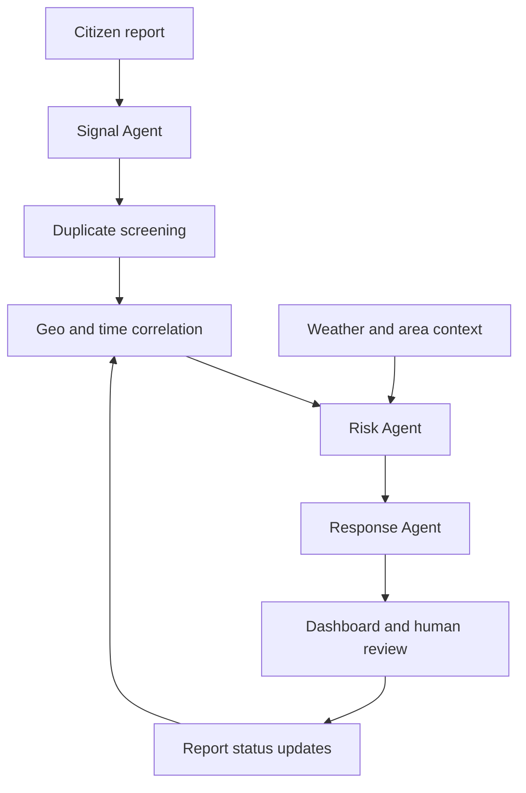

# Karachi PULSE

**AI Urban Early-Warning & Decision Intelligence**

*Connecting weak signals before they become city-wide problems.*

Karachi PULSE connects citizen reports with location, time, weather and infrastructure relationships to identify **possible emerging urban incidents**. It helps users understand where a problem may be developing, why its risk is increasing, and what should be inspected next.

Built with Python and Streamlit, this hackathon prototype combines deterministic analytics with optional Gemini-powered language understanding. Numeric risk and confidence scores are calculated in Python.

> Decision support only. Incident causes remain hypotheses until verified in the field. The application does not contact authorities or dispatch responders.

## The problem

A sewage overflow, an uncollected garbage pile and a blocked drain can look like separate complaints. When they occur close together—and heavy rain is expected—they may indicate a wider drainage problem.

Karachi PULSE looks for these connections, turning scattered observations into explainable incident hypotheses and suggested inspection priorities.

## Features

| Capability | What it does |
| --- | --- |
| Multilingual reporting | Accepts English, Urdu and Roman Urdu descriptions, with automatic or manual categorization |
| Report records | Shows every submission, including isolated reports; supports searching, filtering and editing |
| Duplicate detection | Checks text similarity, distance and time proximity to avoid inflated risk |
| Incident correlation | Links nearby reports using defined cross-category relationships |
| Explainable scoring | Displays risk, separate confidence, contributing factors and observed score changes |
| Weather context | Uses Open-Meteo forecasts in Live mode, with a labelled simulated fallback |
| Interactive map | Shows report markers, shared-location counts, incident circles and selected-report details |
| Review workflow | Supports acknowledgement, inspection and resolution; resolving an incident closes its linked reports |
| Trend analytics | Charts report patterns and observed incident risk/growth during the session |
| Guided demonstration | Builds a drainage scenario over six steps, ending with a severe-rain forecast |
| Backup and export | Exports filtered records to CSV and supports validated JSON report backups |
| Optional Gemini | Falls back to multilingual keywords and response playbooks when Gemini is unavailable |

**Categories:** Sewage, Drainage, Garbage, Roads/Potholes, Water Supply, Flooding, Electricity, Traffic, Public Safety and Other.

## How it works



| Agent | Responsibility |
| --- | --- |
| Signal Agent | Classifies the complaint and extracts infrastructure, keywords, estimated severity and urgency |
| Correlation Agent | Flags duplicates and groups reports using geographic distance, time and explicit relationships |
| Risk Agent | Calculates risk, confidence, score contributions and inspection coordinates |
| Response Agent | Uses a deterministic playbook, optionally enhanced by Gemini, to explain the hypothesis and suggest actions |

The agents are ordinary Python functions. No autonomous-agent framework is required, and Gemini does not invent the numeric incident scores.

### Correlation rules

An incident requires **at least three distinct reports** meeting an applicable relationship rule. The default detection window is **24 hours**, with **every pair no more than 1.5 km apart**. These thresholds are adjustable.

| Related categories | Possible incident |
| --- | --- |
| At least two of Sewage, Drainage, Garbage and Flooding, including Sewage or Drainage | Blocked or overloaded drainage / flooding risk |
| Water Supply + Roads/Potholes + Flooding | Water-line leakage |
| Electricity + Public Safety or Flooding | Electrical hazard |
| Traffic + Roads/Potholes + Flooding | Mobility disruption |

Rain amplifies applicable drainage, electrical and mobility risks. For a suspected water-line leak, rain provides an alternative explanation for standing water and can reduce confidence.

Likely duplicates remain recorded but do not add independent risk or confidence points. Reporter identities are not verified.

### Risk and confidence

**Risk** expresses potential incident severity. **Confidence** expresses the strength of the supporting evidence. Both are prototype heuristics, not validated predictions.

| Risk factor | Maximum points |
| --- | ---: |
| Distinct signal count | 15 |
| Report density | 8 |
| Recent arrival rate | 12 |
| Reported severity | 15 |
| Geographic concentration | 8 |
| Category overlap | 12 |
| Weather | 18 |
| Simulated area vulnerability | 8 |
| Urgency | 4 |
| **Total** | **100** |

Risk bands: **Low 0–29**, **Moderate 30–49**, **Elevated 50–69**, **High 70–84**, **Critical 85–100**.

Confidence uses signal count, category support, spatial/temporal support and classification quality. It is capped at 95% and is not a calibrated probability. Exact formulas and incident-specific contributions are available in the app.

## Quick start

Use **Python 3.11 or newer**. Clone or download this repository, then open a terminal in the folder containing `app.py`.

```bash
python -m venv .venv
```

Activate the environment:

```powershell
# Windows PowerShell
.venv\Scripts\Activate.ps1
```

```bash
# macOS / Linux
source .venv/bin/activate
```

Install dependencies and start the application:

```bash
python -m pip install -r requirements.txt
python -m streamlit run app.py
```

The demo works without a Gemini API key. No database server or separate backend is required.

### Optional Gemini setup

For local use, create `.streamlit/secrets.toml` in the project root:

```toml
GEMINI_API_KEY = "replace-with-your-api-key"

# Optional: use an exact model ID available to your Google API project.
# GEMINI_MODEL = "your-available-model-id"
```

The default model is defined by `DEFAULT_GEMINI_MODEL` in `pulse/config.py`. Override it through `GEMINI_MODEL` or **Settings → AI connection** when using a different available model.

Enable the processing checkbox under **AI connection**. New submissions can then use Gemini classification. Select **Explain with AI** in an incident detail view to request an explanation.

The project uses Google's official `google-genai` SDK. Invalid keys, unavailable models, request failures or invalid structured responses trigger fallback behavior. Check the displayed classification/explanation method to see which path was used.

Keep API keys out of GitHub. The included `.gitignore` excludes `.streamlit/secrets.toml`, environment files and virtual environments. Avoid including personal information in reports sent to Gemini.

## Demo and Live workspaces

| | Demo | Live |
| --- | --- | --- |
| Starting reports | Synthetic Karachi data | Empty workspace |
| Incoming reports | Manual input and guided simulation | Manual input and restored Live backups |
| Clock | Includes the demonstration time offset | Current real time |
| Weather | Scripted scenario | Open-Meteo, with labelled fallback on failure |
| Purpose | Demonstrate correlations and escalation | Test the workflow with your own reports |

Switching modes preserves each workspace separately for the current session. Live mode does not automatically ingest social media or government complaint feeds.

### Run the showcase

1. Select **Demo → Overview**.
2. Expand **Try the six-step demo**.
3. Press **Simulate Incoming City Signals** once per step.

The scenario adds sewage, drainage and garbage reports in Gulshan-e-Iqbal. Its final step changes the forecast to severe rain. The reports form an incident, and weather raises its risk. Open the incident details to inspect the supporting reports, scoring factors and recommended inspection point.

The dataset also includes background complaints, a moderate cluster and a high-risk cluster in other Karachi areas.

### Submit a live report

Select **Live → Add a report** and enter an observation such as:

> Gali mein gutter overflow ho raha hai.

The report appears immediately in **Overview → Recent reports** and **Report records**, and receives a map point. Use **Show new report on map** to locate it. Without coordinates, the selected area's approximate center is used.

One report does not automatically create an incident. Additional distinct, related reports must meet the correlation rule. Shared-location markers grow with report count; incident circles reflect distinct signal count and risk.

## Project structure

`app.py` is the entry point. Python imports the remaining modules; Streamlit does not concatenate files. Preserve the folder structure and package `__init__.py` files.

| Location | Responsibility |
| --- | --- |
| `app.py` | Start the application |
| `pulse/config.py` | Categories, locations, authority suggestions, rules, weights, model default and limits |
| `pulse/agents/` | Separate Signal, Correlation, Risk and Response agents |
| `pulse/models.py` | Structured Gemini output validation |
| `pulse/services.py` | Gemini, weather, secrets and API fallbacks |
| `pulse/data.py` | Report creation, validation, backup and restore |
| `pulse/demo.py` | Synthetic reports and scenario definitions |
| `pulse/session.py` | Workspaces, simulation, incident history and live refresh |
| `pulse/utils.py` | Geographic distance, text and time helpers |
| `pulse/ui/app.py` | Evaluate the current snapshot and route to a screen |
| `pulse/ui/sidebar.py` | Navigation, settings and backup controls |
| `pulse/ui/overview.py` | Overview and demonstration controls |
| `pulse/ui/reports.py` | Submission, records, editing and CSV export |
| `pulse/ui/incidents.py` | Incident queue, details and review workflow |
| `pulse/ui/maps.py` | Interactive maps and selection details |
| `pulse/ui/analytics.py` | Charts and trends |
| `pulse/ui/about.py` | In-app explanation of the system |
| `pulse/ui/components.py` | Shared weather panel |
| `pulse/ui/theme.py`, `pulse/ui/styles.css` | Chart styling and interface appearance |
| `.streamlit/config.toml` | Native Streamlit colors and light theme |
| `tests/test_charts.py` | Sparse-data chart scale regression checks |
| `tests/test_workflows.py` | Core and UI regression tests |
| `requirements.txt` | Deployment dependencies |

UI modules use the agents and data/services modules. The agents do not import UI modules. This direction keeps dependencies manageable and avoids circular imports.

## Deploy to Streamlit Community Cloud

1. Upload the extracted project files and folders to GitHub, preserving their structure.
2. Keep `app.py`, `requirements.txt` and `pulse/` together at the repository root.
3. In Streamlit Community Cloud, choose the repository and branch, and set the main file path to `app.py`.
4. Add `GEMINI_API_KEY` and optionally `GEMINI_MODEL` in the app's **Secrets** settings.
5. Deploy, then enable Gemini processing inside **AI connection** if needed.

If the project sits inside a repository subfolder, use its corresponding path to `app.py`. Upload all modules and the CSS file along with the entry point.

References: [Streamlit deployment](https://docs.streamlit.io/deploy/streamlit-community-cloud/deploy-your-app) · [Gemini API](https://ai.google.dev/gemini-api/docs) · [Open-Meteo](https://open-meteo.com/en/docs).

## Tests

Run from the project root:

```bash
python -m unittest discover -s tests -v
```

The suite checks multilingual fallback, spatial/time rules, duplicate suppression, forecast influence, backup validation, weather-service failure, workspace isolation, report records, map output and incident resolution/reopening.

Tests use mocked weather requests and need no Gemini key. They do not verify live provider availability, browser rendering or map-tile loading.

## Data retention and limitations

- **Session storage:** navigation and the app's refresh button retain reports. A browser reload, lost session or server restart can reset them. Separate users do not share a report database.
- **Backups:** download JSON from **Report backup & restore** and restore it in the matching workspace. Existing report IDs are not overwritten. Backups preserve reports and report statuses, not incident score history or API keys.
- **CSV export:** filtered records can be exported for review. JSON is the supported restore format.
- **Refresh:** live analysis reevaluates approximately every minute while connected. Weather is cached for 15 minutes and can be refreshed manually.
- **Capacity:** each workspace supports up to 1,000 reports. Pairwise analysis is intended for prototype-sized datasets.
- **Evidence quality:** reports are unverified; keyword fallback can miss slang or negation. Default locations are approximate and area vulnerability values are simulated.
- **Interpretation:** greedy bounded clustering can depend on report order. Multiple hypotheses can share reports, so incident counts are not a count of confirmed independent failures.
- **Operational scope:** authority suggestions require jurisdiction and asset-ownership checks. The prototype has no authenticated municipal workflow or automatic dispatch.

## Technology

Python · Streamlit · Pandas · NumPy · Plotly · Scikit-learn · Google Gen AI SDK · Pydantic · Requests · Open-Meteo

## Potential next steps

Persistent shared storage, authenticated review roles, verified historical data, calibrated scores and authorized external report ingestion are future improvements—not current capabilities.
